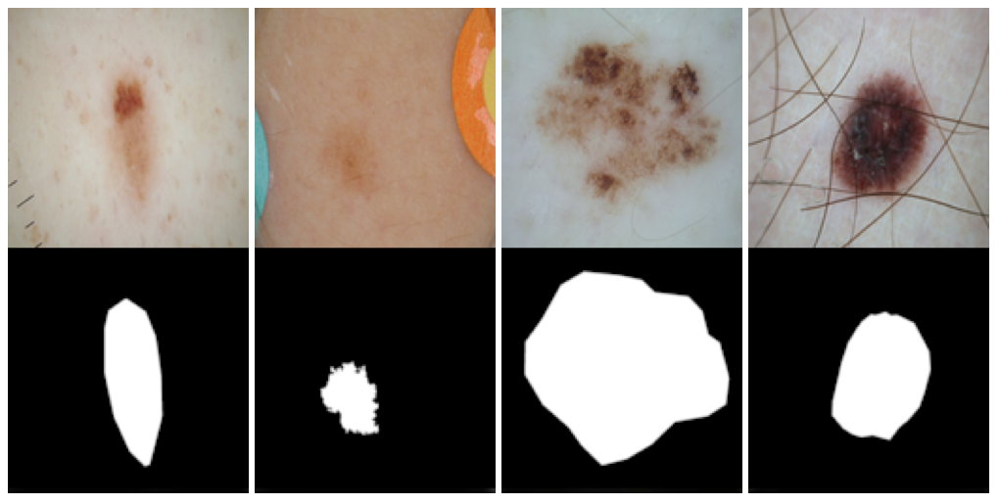

# Lesion skin cancer segmentation
### Based on the ISIC 2018 challenge which goal was to create automated predictions of lesion segmentation boundaries within dermoscopic images.

***
## Research report
This is my research report on the impact that different preprocessing techniques have on the model's final performence. Written in PL. [document](src/Segmentacja - badanie skuteczności wybranych metod wstępnego przetwarzania obrazu.pdf)

## Image segmentation  
Segmentation is performed using U-Net Convolutional Neural Network. 

### Best achieved results (test set): Accuracy 95.1%, Jaccard score 80.8%, Sensitivity 86.8%, Specifitivity 97.4%
With parameters:
- image size: 256x256
- batch size: 8
- epochs: 70 (Early Stopping patience=10)
- feature channels configuration: [32,64,128,256,512]
- optimizer: adam
- loss: binary_crossentropy
- preprocessing: [augumentations, histogram equalization, per-channel normalization]

***

## How to get started

### Dataset
Data can be downloaded from the official site of the ISIC2018 challenge:  https://challenge2018.isic-archive.com/participate/

### Training
1. Download data from the official site (alternatively you can use uploaded `npy_datasets/data/`)
1. Run `dataset_creator.py` and pass image paths as the function arguments
1. Adjust runs.json config file to your needs
1. Use `run_training_from_config` from `train_interface.py`
1. After training is completed, you can use `predict.py` to predict masks based on saved model 

### Predicting on pre-trained 
If you just want to do a predictions on your images, go to `predict.py` and with the default setting you should be able to feed your data into predict function and get your results.  

###  Environment requirements
- python >= 3.8
- tensorflow >= 2.4
- numpy
- Pillow
- scikit-learn
- opencv
- mlflow
- matplotlib
- pandas

***

## Preprocessings

Research focused on preprocessing methods, which were: Augumentations, Histogram Equalization, Per-channel mean normalization, Gaussian Blur, ZCA whitening, Connected components.

Through research, an optimal set of methods has been identified and UNet model combined with those methods is capable of obtaining Jaccard index value around 81%.

***
## References  
1. Ronneberger O., Fischer P., Brox T. (2015) U-Net: Convolutional Networks for Biomedical Image Segmentation. In: Navab N., Hornegger J., Wells W., Frangi A. (eds) Medical Image Computing and Computer-Assisted Intervention – MICCAI 2015. MICCAI 2015. Lecture Notes in Computer Science, vol 9351. Springer, Cham. https://doi.org/10.1007/978-3-319-24574-4_28
  
1. Sara Ross-Howe, H.R. Tizhoosh - "The Effects of Image Pre- and Post-Processing, Wavelet Decomposition, and Local Binary Patterns on U-Nets for Skin Lesion Segmentation" - Kimia Lab, University of Waterloo, Waterloo, Ontario, Canada  

1. Tschandl, P. et al. The HAM10000 dataset, a large collection of multi-source
dermatoscopic images of common pigmented skin lesions. Sci. Data 5:180161 doi: 10.1038/sdata.2018.161 (2018).  

1. Nabila Abraham, Naimul Mefraz Khan - "A NOVEL FOCAL TVERSKY LOSS FUNCTION WITH IMPROVED ATTENTION U-NET FOR LESION SEGMENTATION" - Ryerson University Department of Electrical and Computer Engineering 350 Victoria Street, Toronto, ON  

1. https://challenge2018.isic-archive.com/participate/

